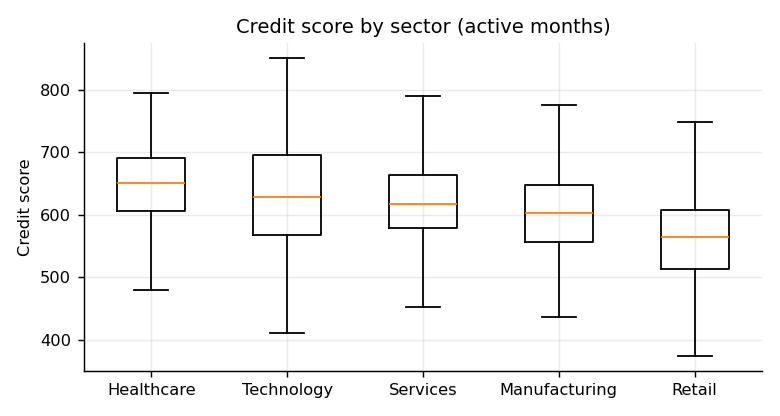
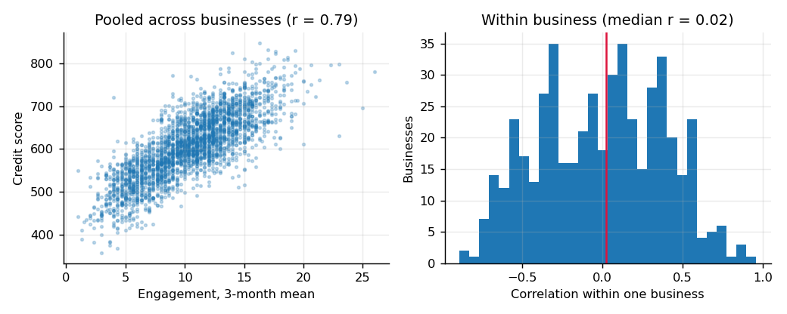
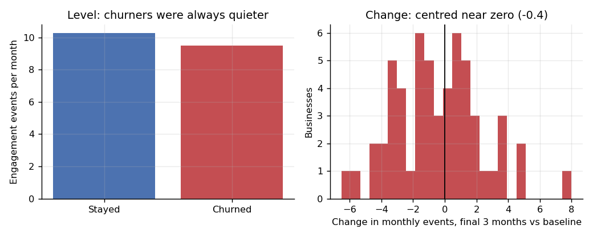
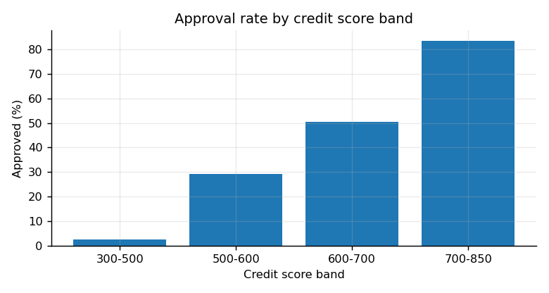
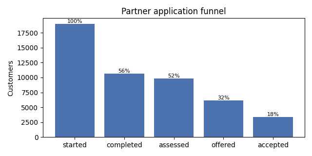
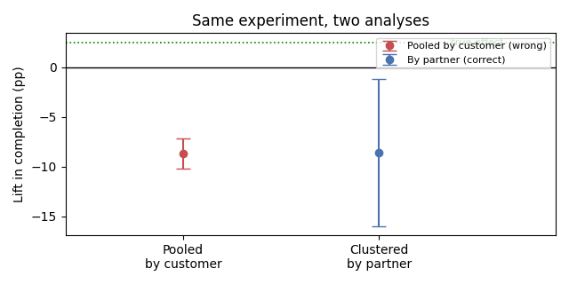

# Credit Insight Compass

An analysis of SME credit health, product engagement and partner-channel conversion, built on
simulated data. Six questions a lender's analytics team would actually be asked, including an
A/B test that a standard calculator gets confidently wrong.

Everything here runs from one command and every number in this README is produced by that
command. Nothing is typed in by hand.

```bash
pip install -r requirements.txt
python run.py
```

That generates the data, runs the quality checks, does the analysis, and writes
`outputs/findings.md` and the charts below.

> **This is a portfolio project on synthetic data.** I built it to work through the kind of
> analysis an SME lender does. I have not worked for iwoca and no real customer data is
> involved. The generator plants known structure on purpose and documents what it planted,
> which is the only way findings on simulated data mean anything.

---

## What I found

### 1. Sector matters, but less than the spread inside a sector

Mean credit score runs from **565** in Retail to **648** in Healthcare, a gap of 84 points.
Within any single sector the standard deviation is **70 points**. So sector tells you
something about a book of businesses and very little about the one in front of you.



### 2. Engagement and credit score correlate at r = 0.79 between businesses and r = 0.02 within them

This is the finding I would lead with, because the obvious version of it is wrong.

Pool every business together and engagement looks strongly related to credit score. Follow
each business separately, watching whether its own score moves when its own engagement
moves, and the relationship almost vanishes.

The pooled number is mostly telling us **who signs up**, not what the product does.
Healthier businesses both engage more and score higher. Reporting r = 0.79 as evidence that
the product improves credit would be a real and expensive mistake, and it is the kind that
survives review because the chart looks convincing.



Establishing an actual product effect would need engaged businesses compared against
similar businesses that did not engage. That is a different piece of work and I have not
done it here.

### 3. Churn shows up as a level, not as a drop

**13%** of businesses left during the window. Across their active months they averaged
**9.5** engagement events against **10.3** for businesses that stayed.

But comparing each churner's final three months against its own earlier baseline, the
average change was **-0.4 events**, and only **55%** declined at all — roughly a coin flip.
The businesses that left were quiet from the start. They did not go quiet.



That changes what you would build. An alert watching for a sudden fall in usage would fire
late and mostly on the wrong accounts. Screening the book for sustained low usage would find
them, and could run quarterly rather than monthly.

### 4. Applications are gated by engagement, approvals by credit score

**1,433** applications, **45%** approved. Approval runs from **2%** in the 300–500 score
band to **84%** above 700.

Almost every application came from a business that had used the product that month, so the
funnel narrows at engagement before it narrows at credit. If you want more good
applications, the lever is engagement among businesses that would pass, not the approval
threshold.



### 5. The partner funnel loses most of its customers before the credit decision

Of **19,000** started applications, **3,383 (17.8%)** end in an accepted offer. The costliest
step is data collection, where **8,322** customers are lost, more than at any other stage.

The steepest percentage drop is somewhere else, at acceptance, where only 55% carry through.
Those are different problems and worth separating: a bad rate late in the funnel affects
fewer people than a mediocre rate at the top. Effort goes where the customers are.



### 6. A pre-qualification test that looks conclusive, and gets the sign wrong

This is the part I would most want to talk through.

The feature was switched on **per partner**, not per customer, which is how integrations
usually get rolled out. Pool every application and you get a lift of **-8.7pp with a 95%
interval of ±1.5pp** — the number a standard A/B calculator returns, and it is wrong twice
over.

There are six independent units in this experiment, not 19,000. Customers inside one partner
are alike, so treating them as independent shrinks the interval towards nothing. And with six
clusters, randomisation did not balance them: the treated arm drew traffic averaging **0.39**
on quality against **0.63** for control, so the arms differed before the feature was touched.

Comparing partner-level rates instead gives **-8.6pp, ±7.4pp** — which does not exclude zero,
and is the honest answer.



The true effect built into the simulation is **+2.5pp**. So the naive analysis does not just
overstate its confidence, it reports the wrong direction inside a very tight interval. The
design cannot resolve an effect this size. The fix is more partners, randomising within
partner, or difference-in-differences against each partner's own pre-period. It is not more
customers.

---

## The data

Simulated: 500 businesses, 18 monthly observations each, and roughly 87,000 engagement
events. Generated from a fixed seed, so the same command always produces the same data and
anyone can check these numbers.

`src/generate.py` documents exactly what structure is planted — a hidden health score per
business, credit scores that revert towards a target rather than wander, engagement that
depends on health, funding that depends on score and engagement, and churn as a monthly
hazard rather than a label. An analysis that recovers that structure is showing method. One
that recovers something else has found an artefact.

**The raw files are deliberately messy**, because a pipeline that has never met a bad row
proves nothing:

| Planted problem | What the pipeline does |
| --- | --- |
| 400 duplicated engagement events (a replayed batch) | Deduplicated on `event_id`, count reported |
| 18 businesses with no region | Grouped as `Unknown`, not dropped |
| 12 credit scores outside 300–850 | Set to null, **not clipped** |
| 1 business created after the observation window opens | Flagged, tenure not computed |
| 1,500 timestamps in `dd/mm/yyyy` instead of ISO | Both formats parsed |

The clipping decision is the one I would defend hardest. Clipping a 1200 to 850 turns an
obvious error into a plausible value, and it never looks wrong again.

## How it is put together

```
run.py                  one command: generate, validate, analyse
src/generate.py         simulation, with the planted structure documented
src/validate.py         data quality checks
src/analyse.py          cleaning, features, questions 1-4, charts
src/experiment.py       partner funnel and the pre-qualification experiment
tests/test_pipeline.py  five tests
data/raw/               generated extract, deliberately messy
data/clean/             analysis-ready, ready for Tableau or Power BI
outputs/findings.md     the findings, regenerated on every run
outputs/figures/        the charts in this README
```

The validator separates **warnings** from **failures**. A warning is a defect the pipeline
is expected to handle, and it gets reported and counted. A failure means the analysis would
be wrong and nobody would notice — an empty table, a duplicated business, a month missing
from the panel — and it raises. A check that only ever prints is a check nobody reads.

`pytest tests/` covers the five things that could go wrong quietly: that generation is
reproducible, that a gap in the panel is rejected, that a per-business total broadcast onto
monthly rows is caught, that the rolling engagement feature excludes its own month so it could
legitimately be used as a predictor, and that the clustered confidence interval stays wider
than the pooled one.

That third test exists because it was a real bug in the first version of this project. A
business-level engagement total was joined onto every monthly row, so any BI tool summing
the column would have multiplied it by eighteen.

## What this is not

- **Not real data**, and not a claim about iwoca's actual book.
- **Not a causal analysis, deliberately.** Findings 2 and 6 are both about why the obvious
  causal reading does not survive contact with how the data was produced.
- **No dashboard.** The clean extract in `data/clean/credit_insight.csv` is shaped for one —
  one row per business per month, no pre-aggregated totals — but I would rather ship four
  charts that exist than promise a dashboard that does not.
- **No model.** These questions are answered with descriptive analysis and interval
  estimation, which is what they needed. Adding a classifier would have been decoration.
- **The experiment is simulated, including its true effect.** That is the only way to show
  that an analysis recovers the wrong answer, since with real data nobody knows the right
  one.

## Built with

Python, pandas, NumPy, matplotlib, pytest.

**Olaoluwa Olukoya** · [github.com/Carsell](https://github.com/Carsell)
